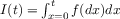
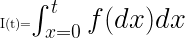

# Goal

Markdown format does not allow yet to write directly latex equations.
This Python script will parse your markdown file using a regular expression matcher and will generate an image for each markdown image insertion command of the type

	 

you just need to run in the shell

	sudo python create_latex_images.py your_markdown_file.md
(for some reason we need sudo to generate png images or we get all white images)

**we recommand using svg image files** because

* they give nice vector images without visible pixel aliasing artefacts
* they are in a text format which is **good for versioning** with git or mercurial: as long as you don't change an equation, the corresponding svg get regenerated as you launch the script but as its textual content remains unchanged no change will be detected and commited.

# Examples

	 
	
Gives: 

	 
	
Gives: 

 

	 
	

This would works on bitbucket but gives a broken link on github:

This is due to the fact that github does not allow to include svg files with a relative paths like that [see reasons here](https://github.com/potherca/StackOverflow/tree/gh-pages/question.13808020.include-an-svg-hosted-on-github-in-markdown). 

You need to use the following trick

	

and you get 

lager size:

	

	

